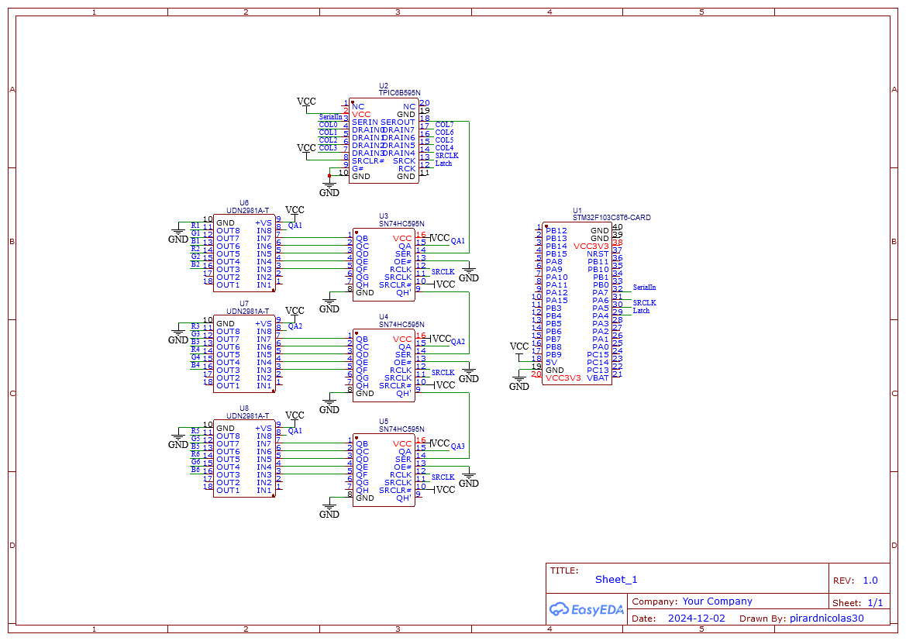

# DIY midi controller (work in progress)

This repo serves as base documentation and ressources for a project I'm currently working on.
This idea is to create from scratch a MIDI controller to be interfaced with software such as Resolume or Ableton to control in live some lights installation.
The controller integrates : 
- 8x6 rgb button matrix which is based on Novation Launchpad layout.
- for each of the 8 channels : 1 rotary encoder, 4 potentiometer and 1 crossfader 

## RGB button matrix

## Model case
